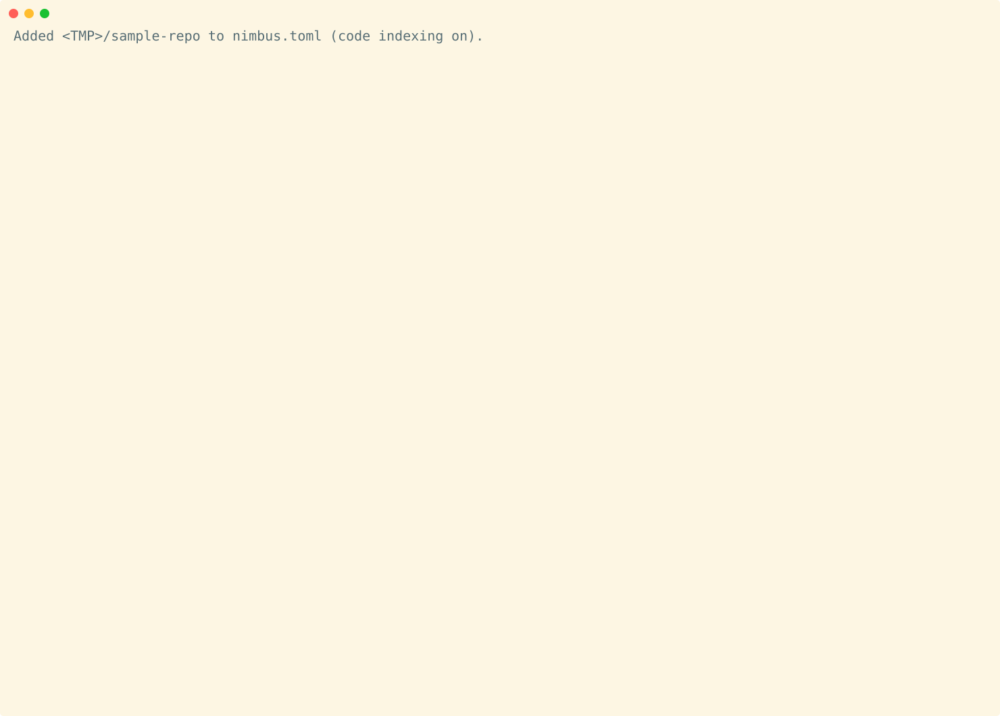

<div align="center">

# ☁️ Nimbus

### On-Call Intelligence for DevOps, SecDevOps, and Platform Engineering Teams.

*Cross-service incident context in under 100ms. Consent-gated automation. Your credentials never leave the machine.*

[](https://nimbus-agent.dev)
[](https://bun.sh)
[](https://typescriptlang.org)
[](https://modelcontextprotocol.io)

[](../LICENSE)
[](https://github.com/nimbus-agent/Nimbus/releases/latest)


<picture>
  <source media="(prefers-color-scheme: dark)" srcset="./assets/hero-cast-dark.svg">
  <source media="(prefers-color-scheme: light)" srcset="./assets/hero-cast-light.svg">
  
</picture>

</div>

---

Nimbus is an open-source, local-first AI agent built for engineers who run systems in production. A headless **Nimbus Gateway** runs on your machine, maintains a private SQLite index across your entire developer toolchain — source control, CI/CD, cloud infrastructure, monitoring, and incident management — and executes multi-step tasks on your behalf. Every write, send, or delete requires your explicit approval before it runs.

**Your credentials never leave your machine. There is no Nimbus server.**

Every architectural decision in Nimbus is evaluated against one question:

> **Does this return control to the user, or does it erode it?**

The non-negotiables in [Contributing](#contributing) follow from that question — they are load-bearing constraints, not aspirational values.

---

## What It Does

```bash
# Incident response — answered from the local index, no API calls, under 100ms
nimbus ask "The payment-service alert just fired — what changed in the last 2 hours?"

# Release readiness — cross-service without tab-switching
nimbus ask "Which of my open PRs have failing CI and are blocking the release branch?"

# SecDevOps — correlate security signals with your codebase
nimbus ask "Which repos have critical Dependabot alerts with open PRs touching the affected packages?"

# Infrastructure — query state across providers
nimbus ask "What Terraform drift has been detected since last week's deployment?"

# Data lineage — answered from the local index, no warehouse query
nimbus ask "The Q1 revenue dashboard shows zeroes — which upstream model broke?"

# Expert routing — find who has the most context on a topic
nimbus ask "who has the most context on the payment retry logic?"

# Blast radius — answered from the relationship graph before you push
nimbus ask "what services depend on src/billing/retry.ts, and which dashboards or pipelines would feel a change to it?"

# Consent-gated automation — full plan preview before anything executes
nimbus run ./incident-response.yml
```

**Example session:**

```
$ nimbus ask "The payment-service alert just fired — what changed?"

🔍 PagerDuty: P1 — Error rate 4.2% — fired 8 minutes ago
🔍 Last deploy: payment-service v2.14.1 — 23 minutes ago
🔍 GitHub diff v2.14.0 → v2.14.1: 3 files — src/billing/retry.ts most significant
   PR #312 "Increase retry backoff" — merged by @elena 41 minutes ago

⚠  CONSENT REQUIRED — Post incident summary to #incidents?
   Post? [y/n]: y  ✅ Posted.

Suggested next step: rollback to v2.14.0?
⚠  CONSENT REQUIRED — Trigger Jenkins rollback job.
   Rollback? [y/n]: n  Aborted. No changes made.
```

**SecDevOps example:**

```
$ nimbus ask "Critical CVE dropped for lodash — what's our exposure?"

🔍 Scanning local index: 47 repos indexed, 12 have lodash as a direct dependency
🔍 Active PRs touching lodash: 3 open PRs across payment-service, auth-gateway, api-proxy
🔍 Sentry: 2 production errors last 24h in lodash code paths (payment-service)
🔍 Jira: No active tickets for this CVE yet

Suggested next step: Create Jira tickets for affected repos?
⚠  CONSENT REQUIRED — Create 3 Jira tickets and assign to component owners.
   Proceed? [y/n]: y  ✅ Created PLAT-1847, PLAT-1848, PLAT-1849.
```

**Data lineage example:**

```
$ nimbus ask "The Q1 revenue dashboard shows zeroes — which upstream model broke?"

🔍 Tableau: dashboard "Q1 Revenue" — last refresh failed 12 minutes ago
🔍 Upstream Looker view: revenue_daily → dbt model revenue_daily_agg
🔍 dbt Cloud: revenue_daily_agg — last run failed 14 minutes ago
🔍 Airflow: DAG daily_revenue_etl — task load_fact_orders failed with SQL error
🔍 GitHub PR #842 "Rename order_amount → gross_amount" — merged by @priya 28 minutes ago
   No downstream dbt model updated to match the rename.

Suggested next step: Revert PR #842 and rerun the DAG?
⚠  CONSENT REQUIRED — Revert PR #842 and trigger Airflow DAG rerun.
   Proceed? [y/n]: n  Aborted. No changes made.
```

---

## Who It's For

Nimbus is built for engineers and operators who run systems in production. If your on-call rotation spans five monitoring tools and three cloud consoles, Nimbus is the intelligence layer that collapses that context into a single query.

| Role | What Nimbus gives you |
|---|---|
| **On-call / SRE** | Instant incident context — last deploy, triggering commit, CI result, Slack thread — in one query, without seven browser tabs |
| **Platform Engineer** | Drift detection, multi-cloud infra state, deployment correlation, CI/CD and build pipeline monitoring (Bitrise), consent-gated IaC apply and rollback |
| **Security Engineer** | Alert-to-commit tracing, CVE-to-PR correlation, vulnerability and code analysis insights (Snyk, Semgrep, SonarQube/SonarCloud), full audit log for every agent action, compliance posture queries |
| **Senior Developer** | Cross-repo PR intelligence, release readiness checks, pipeline context, local-only credential storage; OpenAPI / AsyncAPI spec indexing for "which services expose this endpoint?" queries (Phase 5) |
| **Team Lead / Engineering Manager** | Cross-service activity digest, changelog generation, expert routing, blast radius analysis — without asking anyone |
| **Analytics Engineer / Data Scientist** | Cross-stack lineage from dashboard to dbt model to warehouse table to orchestration DAG — one local query instead of five consoles; metadata-only ingestion keeps row data on the warehouse |

This is not a tool for everyone. There is no managed cloud service, no Nimbus account, and no relay server. If that's what you need, look elsewhere.

---

## Why Engineers Choose Nimbus

### Fast — Most Queries Never Hit the Network

Nimbus maintains a local SQLite metadata index. Searching across 50,000 indexed items across five services takes under 100ms — faster than opening a new browser tab.

| Operation | Nimbus (local index) | Typical SaaS |
|---|---|---|
| Search across all services | ~20–80ms | 1,500–4,000ms |
| List recent files from 3 services | ~5ms | 3× API round trips |
| Semantic recall (embeddings) | ~50–200ms | Remote embed + search |
| Gateway cold start | ~80ms | Always-on cloud |

*Measured on a mid-range laptop; 50k item index across 5 connected services.*

### Secure by Architecture

- **Credentials** are stored in your OS-native keystore (Windows DPAPI, macOS Keychain, Linux Secret Service). There is no code path that writes them to disk, logs, or IPC responses.
- **The HITL consent gate** is implemented in the executor, not the prompt. A model that generates a plan to skip confirmation produces a plan that simply does not execute.
- **Extensions** run in sandboxed child processes. They receive only credentials for their declared service and cannot enumerate Vault keys or access other connectors.
- **Prompt injection** is mitigated by injecting file content and API responses as typed `<tool_output>` data blocks, never as instructions.

### True Cross-Platform

Windows, macOS, and Linux are equally supported. Every PR runs a full gate on Ubuntu (typecheck, lint, build, tests). Pushes to `main` run the full three-platform matrix in parallel. Platform-specific code (IPC, secrets, autostart, notifications) lives behind a typed `PlatformServices` abstraction — business logic never knows which OS it's on.

### Extensible

Third-party connectors ship as npm packages. Install in one command; the agent gains a new capability immediately. A local Extension Marketplace lives in the Tauri desktop app — code-complete in Phase 4 and shipping as the separate `desktop-v0.1.0` tag in Phase 13 (the headless `v0.1.0` covers Gateway + CLI + VS Code extension only).

---

## Connectors

Every tool your on-call rotation depends on, unified in one local index. Cross-service queries are answered without an API call — the data is already there.

**Phase 1–2 (shipped):** Local Filesystem, Google Drive, Gmail, Google Photos, OneDrive, Outlook, Microsoft Teams, GitHub, GitLab, Bitbucket, Slack, Linear, Jira, Notion, Confluence, Discord (opt-in)

**Phase 3 (shipped):** Jenkins, GitHub Actions, CircleCI, GitLab CI, AWS, Azure, GCP, Kubernetes, Terraform/Pulumi/CloudFormation, Datadog, Grafana, Sentry, PagerDuty, New Relic

**Phase 5 (✅ complete):** Wave A + Wave B connectors shipped (Obsidian, OpenAPI / AsyncAPI spec indexer, Snyk, Bitrise, SonarQube / SonarCloud, Semgrep, Wiz, LaunchDarkly, Flagsmith, ArgoCD, Flux, dbt Cloud, Metabase, Superset, Databricks, MLflow, Vercel, Netlify, Stripe, Mercury, Readwise, Raindrop, Intercom, Zendesk, Lever, Greenhouse, Pipedrive, Stack Overflow, Zoom). **Connector Tiers 1–3 shipped:** Zotero, OWASP Dependency-Track, Ramp, Apache Airflow, Prefect, Dagster (Tier 1); HubSpot, Miro, Canva, Figma, Salesforce, Google Meet (Tier 2 — 3-legged OAuth); BigQuery, AWS Athena, CloudWatch Logs, GCP Cloud Logging, Kibana / Elasticsearch, SageMaker, Vertex AI, Great Expectations (Tier 3 — "no-row-data" warehouse / logging / ML: schema & metadata only, never cell values, enforced by a contract test asserting no row-fetch tool on the connector surface). **Tiers 4–5 shipped:** generic IMAP, Fastmail (JMAP), ProtonMail (Bridge) (Tier 4 — email: headers, a capped preview and attachment metadata only); local DB schema indexing, Storybook, and local data-file profiling (Tier 5 — Parquet / CSV / JSONL / JSON schema only, never cell values).

**Phase 6 (Team tier, ✅ complete):** Federation Core, Team Vault + Quorum HITL, Identity/SSO/SCIM, Org Policy + Admin + Observability, ChatOps, and cross-colleague intelligence shipped (Slices 1–6). The warehouse, BI, and data-quality connectors (Snowflake, Tableau, Looker, PowerBI, Monte Carlo, Bigeye) shipped 2026-06-13 with a cross-warehouse lineage graph (Slice 7 / Wave 7a), followed by their team-shared credentials and HITL-gated writes (Waves 7b–7c). Share & Virality (Slice 8 — the signed, redacted, owner-gated outbound `nimbus share` behind invariant `I27`, plus declarative recipes, replay, and sovereign-mesh forwarding) shipped 2026-06-15 → 2026-06-18 (Waves 8a–8d). The deferred Phase 5 items (Slice 9) landed across 2026-06-14 → 2026-07-19: the Mendeley connector (06-14); Workday, the Apple Mail / iCloud Calendar connector, and the HITL-gated ArgoCD / Flux / MLflow writes (06-21); and the web clipper — the gateway surface behind invariant `I30` (06-22) plus its Chrome/Firefox MV3 browser extension in the satellite repo [`nimbus-agent/nimbus-web-clipper`](https://github.com/nimbus-agent/nimbus-web-clipper) (`v0.1.0`, 07-19). SageMaker / Vertex AI writes and paid extensions stay deferred. **The build order from here is the Phase 7+ Sequencing Spine overlay — the current slot is S1 (Local Brain), whose egress-ledger + `nimbus prove` primitive shipped 2026-06-20.**

See the [roadmap](./roadmap.md) for depth and remaining gaps per connector.

### What's in v0.1.0

`v0.1.0` shipped on **2026-05-09** as the headless Gateway + CLI + VS Code extension (the `desktop-v0.1.0` Tauri release vehicle is deferred to Phase 13 — see [§ Phase 13 → Desktop Release Vehicle in the roadmap](./roadmap.md#desktop-release-vehicle)). Phases 3.5–5 are ✅ complete; Phase 6 (Team) is ✅ complete. Highlights shipped in `v0.1.0`:

**Observability & developer experience (Phase 3.5):**

- **`nimbus doctor`** — environment health checks with actionable remediation
- **`nimbus diag`** — full diagnostic snapshot; `slow-queries` subcommand
- **`nimbus query`** — structured index queries with `--sql` guard and `--json` output
- **`nimbus db verify / repair / snapshot / restore / prune`** — data integrity and recovery
- **`nimbus config` / `nimbus profile`** — named config profiles and env-var overrides
- **`nimbus telemetry show / disable`** — opt-in aggregate-only telemetry
- **`nimbus serve`** — read-only local HTTP API on `localhost`
- **`nimbus connector history <name>`** — per-connector health history
- **`@nimbus-dev/client`** — typed IPC wrapper with `MockClient` for extensions and scripts
- **Starlight docs site** — `packages/docs/`; `bun run docs:build`

**Presence (Phase 4):**

- **Local LLM** — `nimbus` runs fully air-gapped via Ollama or llama.cpp; per-task model routing (classification local, planning remote-or-local) with a single-slot GPU arbiter
- **Multi-agent orchestration** — coordinator/worker decomposition with structural HITL on every sub-agent; depth + tool-call gas limits enforced at the executor
- **Voice interface** — `voice.transcribe` / `voice.speak` IPC, opt-in wake-word loop; `whisper-cli` for STT, native TTS per platform; audio never leaves the machine
- **Data sovereignty** — `nimbus data export / import / delete`, BLAKE3-chained audit log with `nimbus audit verify / export`, per-connector reindex with depth control
- **Auto-update** — `nimbus update --check` / `nimbus update`; Ed25519-signed binary manifest verified before install
- **Encrypted LAN remote access** — `nimbus lan open / peers / grant` (pairing-window open/close, peer listing, per-peer write grant); NaCl-box-sealed RPC, no relay, disabled by default
- **Rich TUI** — `nimbus tui` with five-pane Ink layout, inline mid-stream HITL, fallback to `nimbus repl` on unsuitable terminals
- **VS Code extension** — `@nimbus-dev/client`-based; commands, status bar, and HITL via VS Code notifications; published to VS Code Marketplace + Open VSX
- **Per-connector OAuth vault keys** — Google and Microsoft sub-services own their own keys; eliminates scope-collision between connectors
- **Graph-aware watcher conditions** — `[automation].graph_conditions` flag; `owned_by` / `upstream_of` / `downstream_of` predicates over the relationship graph

> **Not in `v0.1.0`:** the Tauri desktop UI is code-complete in Phase 4 but its release vehicle (signed installers + auto-update) ships separately as `desktop-v0.1.0` in Phase 13. See [§ Phase 13 → Desktop Release Vehicle in the roadmap](./roadmap.md#desktop-release-vehicle).

**Landed since `v0.1.0` (Phase 5, shipped):**

*Team Intelligence built-in agents (T3, closed 2026-05-10):*

- **`nimbus expert <topic-or-file>`** — first built-in agent: ranks team members with the most context on a file or topic from indexed PR authorship, review history, and incident involvement. Read-only, no HITL. T3 PR 1 (2026-05-09).
- **`nimbus impact <file-or-PR-url>`** — second built-in agent: reverse-dependency blast radius across services, pipelines, dashboards, and on-call rotations. Five parallel sub-agents over the relationship graph. Read-only, no HITL. `--json` for CI integration. T3 PR 2 (2026-05-09).
- **`nimbus catchup --since <duration>`** — third built-in agent: personalized retrospective digest weighted by the user's historical involvement (services owned, repos contributed to, incidents responded to). Five parallel sub-agents over the local index; three-tier self-person resolver (override → git email → OS username). Read-only, no HITL. `--json` for CI integration. T3 PR 3 (2026-05-10) — closes the T3 epic.
- **Parallel sub-agent dispatch** — `AgentCoordinator.executeAll` now runs sub-tasks concurrently rather than sequentially.

*Wave A — locally-rooted indexers (2026-05-10):*

- **OpenAPI / AsyncAPI spec indexer** — crawls `[[filesystem.roots]]` for `openapi.{yaml,yml,json}`, `swagger.*`, and `asyncapi.*` files; indexes each operation as an `api_endpoint` item with method, path, tags, and service inferred from `nimbus.openapi.toml` overrides or the spec's `info.title`. Emits `api_endpoint → service` graph edges so `nimbus impact` reports include API-surface ramifications. V25 migration. Fully local — no outbound call.
- **Obsidian vault connector** — indexes Markdown vaults discovered via `[[filesystem.roots]]`: frontmatter, backlinks, daily notes. `obsidian_note` item type; `backlinks` edge type. The append-to-daily-note write tool is HITL-gated. V26 migration.

*CI/CD data layer (T4, 2026-05-12 → 2026-05-16):*

- **`nimbus metrics dora`** — four DORA metrics (deployment frequency, lead time, change failure rate, MTTR) computed locally from indexed deploys, PRs, and PagerDuty incidents. T4 PR 2 (2026-05-12).
- **`nimbus deploy preflight`** / `nimbus-agent/query-action` — pre-deploy index check: counts active P1 incidents, failing CI on target ref, and open PR conflicts. T4 PR 3a (2026-05-13).
- **`nimbus deploy annotate`** / `nimbus-agent/annotate-action` — post-deploy annotation via `POST /v1/deployments`, one of the routes on the compile-time `WRITE_ROUTE_ALLOWLIST` (invariant `I13`: allowlist + bearer auth + per-token rate limit + audit-on-rejection; every write to a non-allowlisted route is rejected). T4 PR 3b (2026-05-14).
- **PagerDuty enrichment + pagination + `severity_p1_aliases`** — T4 wrap-up (2026-05-14, 2026-05-16). DORA CFR/MTTR and Preflight active-P1 now compute against real PagerDuty data; org-specific severity strings (`"Critical"`, `"SEV-1"`) opt in via config.

*B1 hardening + semantic layer prep (T6, 2026-05-14 → 2026-05-16):*

- **Invariant `I10` consolidation** — `util/timing-safe-compare.ts` is now the canonical constant-time compare; LAN pairing, HTTP bearer auth, extension verify, and updater all consume it. T6 PR 1.
- **`tool_call_log` (V29) + `audit.toolCalls` IPC** — forensic complement to invariant `I11`: every `<tool_output>` envelope is recorded for after-the-fact reconstruction. Read surface is IPC-only — not LAN-callable, not in the Tauri allowlist, not on the HTTP API. T6 PR 2. Bounded by a daily retention prune (`[audit].tool_call_log_retention_days`, default 90; `0` disables) that appends one `tool_call_log.pruned` entry to the append-only `audit_log` chain.
- **Hybrid embeddings (`vec_items_1536`, V30) + `nimbus index reembed`** — per-`(service, type)` routing sends prose-heavy items to OpenAI `text-embedding-3-small` (1536-dim) while keeping sparse / structured items on local MiniLM (384-dim). Missing `openai.api_key` falls back to MiniLM-only — the gateway never refuses to start. Selective backfill via the CLI; long-running with cancellable progress notifications. T6 PR 3.
- **Typed `dbRun` / `dbExec` migration — invariant `I14`** — 163 direct `db.run` / `db.exec` / `stmt.run` sites migrated to the central wrappers; `SQLITE_FULL` now surfaces as a typed `DiskFullError` instead of being swallowed. Static-audit rule `D12` blocks regressions at CI time. T6 PR 4.

*Extension sandbox (T2 PR 1, 2026-05-17):*

- **Per-OS sandbox runner — invariant `I15`** — every lazy-mesh extension spawn is routed through `wrapServerSpec(...)` → `sandbox-wrapper.ts` → `runner.spawn(...)`. Linux: bwrap user/PID/IPC/mount/network namespaces + seccomp BPF + per-host iptables via `nimbus-sandbox-helper`. macOS: `sandbox-exec` SBPL profile. Windows: AppContainer + `internetClient` capability + orphan-reap for leftover profiles. Manifest-declared `permissions.{network,filesystem}` define the allowed surface; everything else is kernel-denied. Static-audit rule `D10` catches missed wrapping at CI time. Pre-T2 extensions are hard-disabled until reinstalled.

*Verified publisher signatures (T2 PR 2, 2026-05-18):*

- **Ed25519-signed manifests — invariant `I16`** — extension manifests carry an optional `publisher: { id, key }` field + an embedded `signature` field. Ed25519 verification runs at install and startup; unverified or modified manifests are hard-disabled via the `SignatureDisabledRegistry` singleton. Cryptographic primitives (`canonical-json`, `verify-signature`) are bundled in `@nimbus-dev/sdk` (MIT) for easy publisher signing.

*Auto-update with HITL (T2 PR 3, 2026-05-20):*

- **Extension auto-update daemon** — checks the registry periodically for newer signed versions. Bumps require user consent via the `extension.autoUpdate` and `extension.downgrade` HITL action types. Supports two-version active/backup on-disk directories allowing instant rollback on failure or via CLI.

*Dependency resolution (T2 PR 4, 2026-05-21):*

- **DFS-based backtracking solver** — resolves extension dependencies declared in manifests via semver ranges. Tracks dependencies locally in a new `extension_dependency` table (V31 schema), gates installs and updates against conflict errors, and performs startup completeness checks via the `MissingDependencyRegistry`.

*New connectors & tooling (Wave A & B, 2026-05-21 → 2026-05-22):*

- **Snyk, Bitrise, SonarQube, and Semgrep connectors** — first-party security and CI/CD connectors indexing vulnerability scans, build statuses, and code analysis.
- **Published OpenAPI spec** — interactive OpenAPI document exposing the gateway's read-only HTTP surface.
- **Pre-commit hook documentation** — integration guidelines for deploying Nimbus queries as Git hooks.
- **CI/CD integration recipes** — worked, copy-paste-ready examples in [use-in-ci.md](./cli/use-in-ci.md) for running `nimbus query` within GitHub Actions, GitLab CI, and Jenkins to gate deployments or generate release notes.

*Tier-1 and Tier-2 connectors (2026-05-24 → 2026-05-25):*

- **Wiz** (Tier-2, 2026-05-24) — cloud-security CSPM findings via OAuth `client_credentials` + GraphQL `issues(...)`; emits `wiz:issue` items.
- **LaunchDarkly** (Tier-1, 2026-05-24) — feature-flag definitions via REST; emits `launchdarkly:feature_flag` items.
- **Flagsmith** (Tier-1, 2026-05-24) — feature-flag definitions via admin-API-token + DRF-paged REST; emits `flagsmith:feature_flag` items (definitions-only).
- **ArgoCD** (Tier-1, 2026-05-25) — GitOps application sync/health via self-hosted Bearer auth; emits `argocd:application` items (applications-only).

*Coverage floor + preflight workflow (2026-05-26 → 2026-05-28):*

- **Coverage floor — closeout** (PR #427 + PR #445, 2026-05-26 → 2026-05-28) — per-file 80% line-coverage floor met or exceeded across every bun-tested workspace file. Baseline went from 51 → 10 → **0** entries across Phase 7 + Phase 8.
- **Preflight workflow** (PR #428, 2026-05-26) — gate manifest at `scripts/lib/preflight-gates.ts` keeps local `bun run preflight` aligned with every CI gate; a drift test (`scripts/preflight.test.ts`) fails if a CI gate is missing from the manifest.

See [`docs/roadmap.md`](./roadmap.md) for the full delivery list and [`docs/cli-reference.md`](./cli-reference.md) for the complete CLI command reference.

---

## Quick Start

### Prerequisites

#### Required on every platform (source build)

- **[Bun v1.2+](https://bun.sh/docs/installation)** — runtime, package manager, test runner. Verify with `bun --version`.
- **Git** — for cloning the repo and the build's git-info embedding.
- **A C++ build toolchain** — needed for the rare native dep that has no prebuilt binary for your platform.
  - Windows: [Microsoft Visual C++ Redistributable](https://learn.microsoft.com/en-us/cpp/windows/latest-supported-vc-redist) and Visual Studio Build Tools (Desktop development with C++ workload).
  - macOS: `xcode-select --install`.
  - Linux: `build-essential` (Debian/Ubuntu) or `Development Tools` (Fedora/Arch).

#### Required only for the Tauri 2.0 desktop UI (`packages/ui`)

The headless Gateway and CLI build without these. Skip if you only want `nimbus` in the terminal.

- **[Rust toolchain](https://www.rust-lang.org/tools/install)** — install via `rustup`; Tauri needs `cargo` and a stable `rustc` (≥ 1.78 recommended).
- **Platform WebView dependencies:**
  - **Windows 10+** — WebView2 Runtime (preinstalled on Windows 11; install [Evergreen Bootstrapper](https://developer.microsoft.com/en-us/microsoft-edge/webview2/) on older Windows 10 builds).
  - **macOS 13+** — Xcode Command Line Tools (already installed if you ran `xcode-select --install` above).
  - **Linux (Ubuntu/Debian)** — `sudo apt install libwebkit2gtk-4.1-dev libgtk-3-dev libayatana-appindicator3-dev librsvg2-dev`.
  - Other distros: see the [Tauri prerequisites guide](https://tauri.app/start/prerequisites/).

#### Required at runtime on Linux only

- **`libsecret`** — backs the Vault on Linux (Windows uses DPAPI; macOS uses Keychain — both built-in).
  - Debian/Ubuntu: `sudo apt install libsecret-1-0 libsecret-tools` (the `-tools` package provides `secret-tool`, which `nimbus doctor` checks for).
  - Fedora/Arch: `sudo dnf install libsecret` / `sudo pacman -S libsecret`.
  - You also need a running Secret Service implementation — `gnome-keyring`, KWallet (kwallet5/6), or `keepassxc` with Secret Service enabled. On a headless Linux server, use `gnome-keyring-daemon --unlock` in your session script.

#### Native dependencies installed by `bun install`

The Gateway's local embedder uses **`@xenova/transformers`**, which depends on **`sharp`** and a platform binary such as **`@img/sharp-win32-x64`**. These are pulled in automatically by `bun install` — you do not install them system-wide. If Sharp fails to download or build, remove `node_modules` and re-run `bun install` with install scripts enabled.

#### Pre-built binaries (no Bun required on the target machine)

Gateway binaries built with `bun build --compile` bundle JavaScript into a single file. Sharp's native `.node` file may not load inside that layout on some platforms. If `nimbus-gateway` exits with a Sharp error, run the Gateway **from source** with `bun` after `bun install` (for example `cd packages/gateway && bun run dev`). Linux `.deb` / tarball artifacts from CI are normal compiled binaries — end users do not run `npm install sharp`; if a packaged binary ever fails the same way, the fix is in build/packaging, not an extra OS package on the user's machine.

#### Optional — only needed if you enable the corresponding feature

| Feature | Requirement | How to install |
|---|---|---|
| **Local LLM (Ollama)** | [Ollama](https://ollama.com/download) running on `localhost:11434`, plus at least one pulled model (e.g. `ollama pull llama3.2`) | Default endpoint: `http://127.0.0.1:11434`. Set the local model with `nimbus config set llm.local_model <model>` and prefer it with `nimbus config set llm.prefer_local true`. |
| **Local LLM (llama.cpp)** | A `llama-server` HTTP endpoint reachable from the Gateway | Default endpoint: `http://127.0.0.1:8080`; override with `nimbus config set llm.llamacpp_server_path http://127.0.0.1:8080`. The key stores the HTTP base URL, not the binary path. |
| **Cloud LLM (Anthropic)** | Anthropic API key | Export `ANTHROPIC_API_KEY=…` in the Gateway's environment, then `nimbus config set llm.remote_model claude-sonnet-4-6` (provider is inferred from the model id; `claude-*` → Anthropic). |
| **Cloud LLM (OpenAI)** | OpenAI API key | Export `OPENAI_API_KEY=…`, then `nimbus config set llm.remote_model gpt-4o` (provider is inferred; `gpt-*` / `o1-*` / `o3-*` / `o4-*` → OpenAI). |
| **Voice — STT (push-to-talk hotkey / wake-word loop)** | `whisper-cli` (whisper.cpp) on PATH, plus `ffmpeg` for audio capture | Build whisper.cpp from source or install via `brew install whisper-cpp`; `ffmpeg` via your distro/`brew`. Set `voice.whisper_path` if not on PATH. |
| **Voice — TTS** | macOS: `say` (built-in). Windows: PowerShell SAPI (built-in). Linux: `espeak-ng` (preferred) or `spd-say` | `sudo apt install espeak-ng` / `brew install espeak-ng`. |
| **Wake-word loop** | Same as STT, plus a microphone configured at the OS level | Verify with `nimbus doctor` — voice section appears when `[voice].enabled = true`. |
| **GPU acceleration for embeddings or LLM** | Provider-specific (CUDA, ROCm, Metal). Nimbus serializes GPU access via `GpuArbiter` | Configure your provider's GPU support; Nimbus does not require any extra config. |

Once installed, run **`nimbus doctor`** — it checks every prerequisite above and prints actionable remediation for anything missing.

### Install

#### Package managers (recommended — auto-updating)

| Platform | Command |
| --- | --- |
| macOS / Linux (Homebrew) | `brew install nimbus-agent/tap/nimbus` |
| Windows (Scoop) | `nimbus` bucket — see [`install.md`](./install.md#package-managers-recommended--auto-updating) |
| Windows (winget) | `winget install NimbusAgent.Nimbus` |
| Debian / Ubuntu (apt) | signed repo — see [`install.md`](./install.md#linux-repositories-apt--yum) |
| Fedora / RHEL (dnf) | signed repo — see [`install.md`](./install.md#linux-repositories-apt--yum) |

Package-manager and native-installer builds disable the self-updater (the package owns updates); the portable archives below keep it on. The full install matrix — native `.msi` / `.pkg` / `.rpm` installers, the GPG-signed apt/yum repositories, and download verification — lives in **[`install.md`](./install.md)**.

The manual / portable-archive instructions below remain for unsupported distros and air-gapped installs.

#### Linux (`.deb`)

The `.deb` filename includes the version (e.g. `nimbus-headless_0.1.0_amd64.deb`). Set `VER` to the release tag without the leading `v` (see [Releases](https://github.com/nimbus-agent/Nimbus/releases/latest)):

```bash
VER=0.1.0
curl -L "https://github.com/nimbus-agent/Nimbus/releases/download/v${VER}/nimbus-headless_${VER}_amd64.deb" -o nimbus.deb
curl -L "https://github.com/nimbus-agent/Nimbus/releases/download/v${VER}/nimbus-headless_${VER}_amd64.deb.asc" -o nimbus.deb.asc
gpg --keyserver keys.openpgp.org --recv-keys 5A20457CCD8B53FFAA945240886ADA6B487CAB6E
gpg --verify nimbus.deb.asc nimbus.deb
sudo apt install ./nimbus.deb
```

The `.deb` installs `nimbus` and `nimbus-gateway` wrappers under `/usr/local/bin` — already on `PATH` for any Debian/Ubuntu user.

#### macOS (tarball)

```bash
# Apple Silicon
curl -L https://github.com/nimbus-agent/Nimbus/releases/latest/download/nimbus-headless-macos-arm64.tar.gz -o nimbus.tar.gz
# Intel
# curl -L https://github.com/nimbus-agent/Nimbus/releases/latest/download/nimbus-headless-macos-x64.tar.gz -o nimbus.tar.gz
tar -xzf nimbus.tar.gz
cd nimbus-*
./install.sh --yes
# Open a new shell, then:
nimbus --version
```

The bundled `install.sh` copies the binaries to `~/.local/bin` and adds a sentinel-wrapped block to your shell rc file so PATH picks up automatically. No sudo required. Run `./uninstall.sh --yes` to reverse.

#### Windows (zip)

```powershell
Invoke-WebRequest https://github.com/nimbus-agent/Nimbus/releases/latest/download/nimbus-headless-windows-x64.zip -OutFile nimbus.zip
Expand-Archive nimbus.zip
cd (Get-ChildItem nimbus-*).Name
.\install.ps1 -Yes
# Open a new shell, then:
nimbus --version
```

The bundled `install.ps1` (PowerShell 5.1+) copies the binaries to `%LOCALAPPDATA%\Programs\Nimbus\bin` and adds it to your User PATH via the `.NET` registry API (no admin required, no `setx` truncation risk). Run `.\uninstall.ps1 -Yes` to reverse.

#### AppImage (Linux)

The AppImage filename includes the version (e.g. `nimbus-headless-0.1.0-x86_64.AppImage`). Set `VER` to the release tag without the leading `v`:

```bash
VER=0.1.0
curl -L "https://github.com/nimbus-agent/Nimbus/releases/download/v${VER}/nimbus-headless-${VER}-x86_64.AppImage" -o Nimbus.AppImage
chmod +x Nimbus.AppImage
# Run directly:
./Nimbus.AppImage --version
```

#### Linux (tarball)

The Linux tarball filename includes the version (e.g. `nimbus-headless-linux-amd64-v0.1.0.tar.gz`):

```bash
VER=0.1.0
curl -L "https://github.com/nimbus-agent/Nimbus/releases/download/v${VER}/nimbus-headless-linux-amd64-v${VER}.tar.gz" -o nimbus.tar.gz
tar -xzf nimbus.tar.gz
cd nimbus-*
./install.sh --yes
```

#### Verify the download

Every release ships a GPG-signed `SHA256SUMS.asc`:

```bash
curl -L https://github.com/nimbus-agent/Nimbus/releases/latest/download/SHA256SUMS -o SHA256SUMS
curl -L https://github.com/nimbus-agent/Nimbus/releases/latest/download/SHA256SUMS.asc -o SHA256SUMS.asc
gpg --keyserver keys.openpgp.org --recv-keys 5A20457CCD8B53FFAA945240886ADA6B487CAB6E
gpg --verify SHA256SUMS.asc SHA256SUMS
sha256sum --check --ignore-missing SHA256SUMS
```

The fingerprint is published at [`docs/release/SIGNING-KEY.asc`](release/SIGNING-KEY.asc) and in the [Security Policy](SECURITY.md).

### Option B — Build from Source

```bash
git clone https://github.com/nimbus-agent/Nimbus.git
cd Nimbus
bun install          # NOT "bun run install" — that looks for a script and fails
                     # Installs sharp + platform @img/sharp-* for embeddings (via @xenova/transformers)
bun run build
```

Built CLI location:

| OS | Path |
|---|---|
| Windows | `packages\cli\dist\nimbus.exe` |
| macOS / Linux | `./packages/cli/dist/nimbus` |

Add `packages/cli/dist` to your `PATH` or call with a full path.

### First-Run Configuration

The first time the Gateway starts it creates a default `nimbus.toml` in the platform config directory and an empty SQLite index in the data directory:

| Platform | Config (`nimbus.toml`) | Data (`index.db`, `audit.db`, `backups/`, `logs/`) |
|---|---|---|
| Windows | `%APPDATA%\Nimbus\nimbus.toml` | `%LOCALAPPDATA%\Nimbus\data` |
| macOS | `~/Library/Application Support/Nimbus/nimbus.toml` | `~/Library/Application Support/Nimbus` |
| Linux | `~/.config/nimbus/nimbus.toml` | `~/.local/share/nimbus` |

`NIMBUS_CONFIG_DIR` moves the config directory only — it deliberately does not move the data directory, and there is no data-directory override (on Linux the data root follows `XDG_DATA_HOME`). Most TOML keys also have a corresponding `NIMBUS_`-prefixed env var override that wins over the file (e.g. `NIMBUS_AGENT_MODEL`, `NIMBUS_CLASSIFIER_MODEL`, `NIMBUS_TELEMETRY_ENABLED`) — see [`cli-reference.md`](./cli-reference.md#environment-variables).

Pick an LLM before running your first `nimbus ask` — without one, the agent has no reasoning surface. Remote model ids are inferred from the model id: `claude-*` → Anthropic, `gpt-*` / `o1-*` / `o3-*` / `o4-*` → OpenAI. Local model ids are passed to Ollama or llama.cpp through `[llm].local_model`.

```bash
# Cloud (default — fastest path to a working install).
# Defaults are claude-sonnet-4-6 (agent) + claude-haiku-4-5-20251001 (classifier);
# only set these if you want to override.
export ANTHROPIC_API_KEY=sk-ant-…
nimbus config set llm.remote_model      claude-sonnet-4-6
nimbus config set llm.classifier_model  claude-haiku-4-5-20251001

# OR fully local (no network calls; requires Ollama running)
ollama pull llama3.2
nimbus config set llm.local_model llama3.2
nimbus config set llm.prefer_local true
```

See [`docs/cli-reference.md`](./cli-reference.md#configuration-file) for the full `nimbus.toml` schema.

### Start the Gateway

```bash
nimbus start     # Start Gateway as a background process
nimbus status    # Verify it's running; check connector health
nimbus doctor    # Re-run any time something seems off — checks Bun, Vault, Gateway, index, voice, …
```

### Authenticate Services

```bash
# Cloud storage & communication
nimbus connector auth google       # OAuth PKCE — opens browser
nimbus connector auth microsoft

# Developer services
nimbus connector auth github       # PAT — stored in OS keystore
nimbus connector auth gitlab
nimbus connector auth linear
nimbus connector auth jira
nimbus connector auth slack

nimbus connector list              # All connectors + sync status
nimbus connector sync github       # Manually trigger a sync cycle
```

### Query

```bash
nimbus ask "Find all PDFs I received by email last month that I haven't opened"
nimbus ask "Which of my open PRs mention payment-service?"
nimbus ask "What Linear issues am I assigned this week?"
nimbus search "quarterly review" --service google_drive --type pdf --limit 20
```

### Observe and Debug

> **First debugging step:** run `nimbus doctor`. It checks your Bun version, vault availability, Gateway connectivity, index health, and connector states — and prints actionable remediation for anything it finds.

```bash
# Environment health check — run this first when something seems wrong
nimbus doctor

# Structured index queries
nimbus query --service github --type pr --since 7d --json
nimbus query --sql "SELECT title FROM items WHERE pinned = 1" --pretty

# Diagnostics and slow queries
nimbus diag
nimbus diag slow-queries --limit 10

# Connector health history
nimbus connector history github

# Re-ingest a connector at a specified depth (prunes existing body/embeddings; writes audit entry)
nimbus connector reindex github --depth metadata_only

# Database integrity
nimbus db verify
nimbus db repair          # --yes to skip confirmation
nimbus db snapshot
```

### Configure

```bash
nimbus config list
nimbus config get sync.intervalSeconds
nimbus config set sync.intervalSeconds 300
nimbus config validate

nimbus profile create work
nimbus profile switch work
nimbus profile list
```

### Run a Script

```bash
nimbus run ./weekly-cleanup.yml
```

```yaml
# weekly-cleanup.yml
name: weekly-cleanup
steps:
  - Find all PDF files in Google Drive not opened in 90 days
  - Summarize them by project folder
  - Move the ones from the Zurich project to /Archive/2025
  - Send me an email with the summary
```

Before executing, Nimbus shows a full plan preview identifying every step that will require consent:

```
Script: weekly-cleanup (4 steps)

  Step 1  Find PDFs not opened in 90 days       READ — no approval needed
  Step 2  Summarize by project folder            READ — no approval needed
  Step 3  Move 12 files to /Archive/2025         ⚠ REQUIRES APPROVAL
  Step 4  Send summary email                     ⚠ REQUIRES APPROVAL

Proceed? [y/n]:
```

### Install a Community Extension

```bash
nimbus extension install @community/nimbus-notion
nimbus extension list
```

---

## Tech Stack

| Layer | Technology |
|---|---|
| **Runtime** | [Bun v1.2+](https://bun.sh) — native TypeScript, fast startup, built-in SQLite |
| **Language** | TypeScript 7.x strict mode |
| **Agent Framework** | [Mastra](https://mastra.ai) — structured agents, tool registration, workflow orchestration |
| **Integration Protocol** | [Model Context Protocol](https://modelcontextprotocol.io) — all connectors speak MCP; Engine never calls cloud APIs directly |
| **Local Database** | `bun:sqlite` + [sqlite-vec](https://github.com/asg017/sqlite-vec) — metadata index + vector search |
| **Secrets — Windows** | Windows DPAPI |
| **Secrets — macOS** | Keychain Services |
| **Secrets — Linux** | Secret Service API via `libsecret` |
| **IPC** | JSON-RPC 2.0 over Domain Socket / Named Pipe — local-only, no TCP surface |
| **CLI** | Bun + [@clack/prompts](https://github.com/natemoo-re/clack) |
| **Desktop UI** | [Tauri 2.0](https://tauri.app) + React 19 (~5MB native shell) |
| **LLM** | Local Ollama / llama.cpp via the Nimbus router, or Anthropic/OpenAI via the Mastra agent path |
| **Embeddings** | `@xenova/transformers` (local, no API key) / OpenAI (opt-in) |
| **Extension SDK** | `@nimbus-dev/sdk` (MIT-licensed npm package) |
| **Client Library** | `@nimbus-dev/client` (MIT-licensed npm package) — typed IPC wrapper; `MockClient` for scripts and extensions |
| **Testing — Gateway/CLI** | `bun test` |
| **Testing — UI** | Vitest + `@testing-library/react` |
| **Testing — E2E Desktop** | Playwright + Tauri WebDriver |
| **CI** | GitHub Actions — PR: Ubuntu `pr-quality`; Push: full 3-platform matrix |
| **Release** | `bun build --compile` — single signed binary per platform |

---

## Cross-Platform Support

| | Windows 10+ | macOS 13+ | Ubuntu 22.04+ † |
|---|---|---|---|
| **Gateway IPC** | Named Pipe | Unix Socket | Unix Socket |
| **Secrets** | DPAPI | Keychain | libsecret |
| **Autostart** | Registry | LaunchAgents | systemd user |
| **Notifications** | Win32 Toast | NSUserNotification | libnotify/D-Bus |
| **Config dir** | `%APPDATA%\Nimbus` | `~/Library/…/Nimbus` | `~/.config/nimbus` |
| **Desktop UI** | WebView2 | WKWebView | WebKitGTK |
| **CI runner** | `windows-2025` | `macos-15` | `ubuntu-24.04` |
| **Release** | `.zip` + `.msi` (currently unsigned) † | `.tar.gz` + `.pkg` (currently unsigned) † | `.deb` / `.rpm` + AppImage + GPG-signed apt/yum repo |

† **Ubuntu 22.04 is supported for source builds only.** Pre-built Linux binaries are compiled on Ubuntu 24.04 and require **glibc ≥ 2.39** at runtime (Ubuntu 24.04+, Fedora 40+, Debian 13+, Arch / other current rolling releases). Ubuntu 22.04 LTS, Debian 12, and RHEL 9 (and derivatives) will fail with `GLIBC_2.39 not found`. See [SECURITY.md](./SECURITY.md#linux-runtime-support--glibc-floor) for the canonical supported-distro list and rationale.

† **macOS and Windows installers currently ship unsigned** (signing not yet landed). Cross-platform integrity is provided by the GPG-signed `SHA256SUMS.asc` manifest. macOS Gatekeeper and Windows SmartScreen will prompt on first run; this is expected. Apple Developer notarization and Windows Authenticode signing are deferred to a later point release — see [signing-keys.md](./release/signing-keys.md#v010-signing-cut-line).

---

## Security

- **No plaintext credentials** — OAuth tokens live in the OS keystore. There is no code path that writes them elsewhere.
- **Structural HITL gate** — every delete, send, and move is blocked at the executor by a compile-time constant set. The agent cannot reason around a function that doesn't exist.
- **Extension isolation** — third-party extensions run as child processes, receive only their declared service's credentials, and cannot reach the Vault or other connectors. Manifest SHA-256 is verified on every Gateway startup.
- **Full audit log** — every action, including every HITL decision, is recorded in a local SQLite table before the action executes.
- **Internal security audit (B1, 2026-04-25)** — 8 trust surfaces reviewed; 78 unique findings filed (0 Critical); all High and Medium items closed pre-`v0.1.0`. One Low item (`S6-F1`) closed in `v0.1.0`, and the two Tauri-specific Low items (`S4-F6`, `S4-F8`) are deferred to Phase 13 (`desktop-v0.1.0`); see [SECURITY.md](./SECURITY.md#security-audits) for the full record. A formal third-party penetration test is scheduled for Phase 12.

> **Note:** Nimbus's guarantees hold at the process boundary. It is not a firewall, antivirus, or VPN application; endpoint protection (AV/EDR), network security (VPN/Firewall), and OS-level hardening are your responsibility. See [SECURITY.md](./SECURITY.md) for the full boundary definition.

---

## Extensions

Writing a new connector takes an afternoon, not a sprint. The `@nimbus-dev/sdk` handles scaffolding; the Gateway handles OAuth, credential storage, sync scheduling, and HITL enforcement. You write the service API integration.

```bash
nimbus scaffold extension my-connector   # always created at ./my-connector/ in the cwd
cd my-connector && bun test              # scaffolded package.json defines only `test`; dist/index.js is written for you

nimbus extension install .          # Test locally
nimbus ask "search my-connector for quarterly review"

npm publish --access public         # Publish to the community
```

Extensions declare permissions in `nimbus.extension.json`. Write and delete tools must declare `hitlRequired` — the Gateway enforces HITL automatically for those tool calls regardless of how the extension implements them.

---

## Testing

Five-layer pyramid:

1. **Unit (`bun test`)** — Engine logic, Vault contracts, HITL invariants, manifest validation. Co-located with source. Runs in milliseconds.
2. **Integration (`bun test` + real SQLite)** — connector sync, index queries, extension loading and isolation. Each test gets a fresh temp dir + fresh DB.
3. **E2E CLI (`bun test` + Gateway subprocess)** — full CLI command flows against a real Gateway backed by mock MCP servers.
4. **UI Components (Vitest + Testing Library)** — React components in the Tauri WebView. Vitest is used here because `bun test` does not support jsdom.
5. **E2E Desktop (Playwright + Tauri WebDriver)** — full desktop flows on all three platforms. Runs on push to `main` and release tags.

Security scans: `bun audit`, `trivy`, CodeQL on every PR; Dependabot for dependency updates. HIGH/CRITICAL findings block merges.

---

## Project Structure

```
nimbus/
├── packages/
│   ├── gateway/              # Core headless Gateway (Bun)
│   │   └── src/
│   │       ├── platform/     # PAL: win32, darwin, linux implementations
│   │       ├── engine/       # Mastra agent, router, planner, HITL executor
│   │       ├── vault/        # DPAPI, Keychain, libsecret
│   │       ├── db/           # verify, repair, snapshot, health, metrics, latency ring buffer
│   │       ├── connectors/   # Connector registry, lazy mesh, health model
│   │       ├── sync/         # Delta sync scheduler, connectivity probe
│   │       ├── extensions/   # Extension Registry, manifest validator
│   │       ├── telemetry/    # Opt-in aggregate telemetry collector
│   │       ├── config/       # Config loader, profiles, env-var overrides
│   │       ├── llm/          # Ollama + llama.cpp providers, router, registry, GPU arbiter
│   │       ├── voice/        # STT (whisper-cli), TTS (NativeTtsProvider), wake-word
│   │       └── ipc/          # JSON-RPC 2.0 server, HTTP API, Prometheus endpoint
│   ├── cli/                  # nimbus CLI
│   │   └── src/commands/     # ask, search, query, config, profile, diag, doctor,
│   │                         # db, telemetry, connector, extension, workflow, status
│   ├── ui/                   # Tauri 2.0 desktop app (Phase 4)
│   │   └── src/
│   │       ├── components/   # chrome/, dashboard/, hitl/, settings/, updater/, watchers/, workflows/
│   │       └── pages/        # Dashboard, HitlPopup, Marketplace, Onboarding,
│   │                         # QuickQuery, Settings, Watchers, Workflows
│   ├── docs/                 # Astro Starlight documentation site
│   ├── mcp-connectors/       # First-party MCP servers
│   │   ├── google-drive/
│   │   ├── gmail/
│   │   ├── github/
│   │   └── …                 # (all 15+ shipped connectors)
│   ├── admin-console/        # Static admin console served at /admin/*
│   └── github-actions/       # First-party GitHub Actions (not workspace members)
├── docs/
│   ├── README.md             # this file
│   ├── architecture.md       # subsystem design
│   ├── SECURITY.md           # security model + vulnerability reporting
│   ├── roadmap.md            # acceptance-criteria-driven roadmap (gateway)
│   ├── CONTRIBUTING.md       # contributor workflow and constraints
│   ├── CODE_OF_CONDUCT.md    # community standards
│   ├── release/              # release runbooks + manual smoke checklist
│   ├── templates/            # copy-paste CI (e.g. extension authors)
│   └── contributors/         # author walkthroughs
├── .github/
│   ├── workflows/
│   │   ├── ci.yml            # pr-quality + 3-platform matrix
│   │   ├── security.yml      # bun audit + trivy
│   │   ├── codeql.yml
│   │   └── release.yml       # signed binaries → GitHub Releases
│   └── BRANCH_PROTECTION.md
├── bunfig.toml
└── package.json              # Bun workspace root
```

`@nimbus-dev/client` — the typed IPC wrapper consumed by `packages/cli` and the
VS Code extension — lives in its own repo,
[nimbus-agent/nimbus-client](https://github.com/nimbus-agent/nimbus-client)
(npm, MIT), published independently of this monorepo. So does the extension SDK
`@nimbus-dev/sdk` —
[nimbus-agent/nimbus-sdk](https://github.com/nimbus-agent/nimbus-sdk)
(npm, MIT); this repo consumes it as a published dependency.

---

## Roadmap

Nimbus uses phases, not calendar dates. A phase completes when its acceptance criteria pass.

| Phase | Theme | Status |
|---|---|---|
| 1 | Foundation | ✅ Complete |
| 2 | The Bridge (15 connectors) | ✅ Complete |
| 3 | Intelligence (semantic search, CI/CD, cloud) | ✅ Complete |
| 3.5 | Observability & Developer Experience | ✅ Complete |
| 4 | Presence (local LLM, multi-agent, voice, VS Code extension, TUI; desktop UI code-complete) | ✅ Complete |
| 5 | The Extended Surface | ✅ Complete |
| 6 | Team | ✅ Complete |
| 7–9 | Engineering Excellence → Security Engineering → AI Engineering Loop | Planned |
| 10–12 | Autonomous Agent → Sovereign Mesh → Enterprise | Planned |
| 13 | Desktop Distribution (*ships `desktop-v0.1.0`* Tauri signed installers + auto-update) | Planned |
| 14–15 | Agent Evolution (AI v2) → Cross-Organizational Federation (Global Mesh) | Planned |

See [`roadmap.md`](./roadmap.md) for full acceptance criteria and sequencing.

---

## Publishing Releases

```bash
git tag v0.1.0
git push origin v0.1.0
# → release.yml compiles Gateway + CLI for Linux, macOS, Windows
# → creates GitHub Release with binaries + GPG-signed SHA256SUMS.asc
#   (Linux .deb / .AppImage are GPG-signed; macOS .tar.gz and Windows .zip
#    ship unsigned in v0.1.0 — integrity comes from the SHA256SUMS.asc manifest.
#    Tauri desktop installers ship later under the `desktop-v0.1.0` tag.)
```

---

## Contributing

Architecture is stabilizing; not all interfaces are frozen.

1. Read [`architecture.md`](./architecture.md) — understand the four subsystems and their contracts.
2. Review the **non-negotiables** below — they are not aspirational values; PRs that violate them will not be merged.
3. Check issues tagged `good first issue`.
4. Open a discussion before large PRs.

For workflow, verification commands, and PR expectations, see [`CONTRIBUTING.md`](./CONTRIBUTING.md). Community standards are in [`CODE_OF_CONDUCT.md`](./CODE_OF_CONDUCT.md).

**Non-negotiables** — PRs violating these will not be merged:

- Local-first: no credentials or user data leaving the machine without explicit user action
- HITL is structural: consent gate in the executor, not the prompt
- No plaintext credentials: Vault only
- Platform equality: all three platforms, always
- MCP as connector standard: Engine never calls cloud APIs directly
- License integrity: contributions to core packages must be AGPL-3.0 compatible

---

## Pricing

| Tier | For | Status |
|---|---|---|
| **Open Source** | Individual engineers — AGPL-3.0, full feature set for single-user deployments | Available now |
| **Team** | Shared index namespaces, Team Vault, multi-user HITL, LAN federation — Phase 6 | ✅ Complete |
| **Enterprise** | SSO/SCIM, compliance tooling, audit log shipping, Helm/Docker, SLA support — Phase 12 | Planned |

The Extension SDK (`@nimbus-dev/sdk`) is MIT-licensed — extension authors have no copyleft obligation.

Commercial license for embedding Nimbus in a product without AGPL obligations, or for organizations that need Team/Enterprise features before those phases ship: contact the maintainers.

---

## License

**Core (Gateway, CLI, connectors):** AGPL-3.0 — see [LICENSE](../LICENSE). Anyone running Nimbus as a network service must publish their modifications under the same terms. This is intentional: the AGPL protects users by preventing vendors from stripping the privacy guarantees and offering a hosted "Nimbus Cloud."

**Extension SDK (`@nimbus-dev/sdk`):** MIT — extension authors are not burdened by copyleft obligations.

---

<div align="center">

**[Architecture](./architecture.md) · [Roadmap](./roadmap.md) · [Security](./SECURITY.md) · [Releases](https://github.com/nimbus-agent/Nimbus/releases)**

</div>
