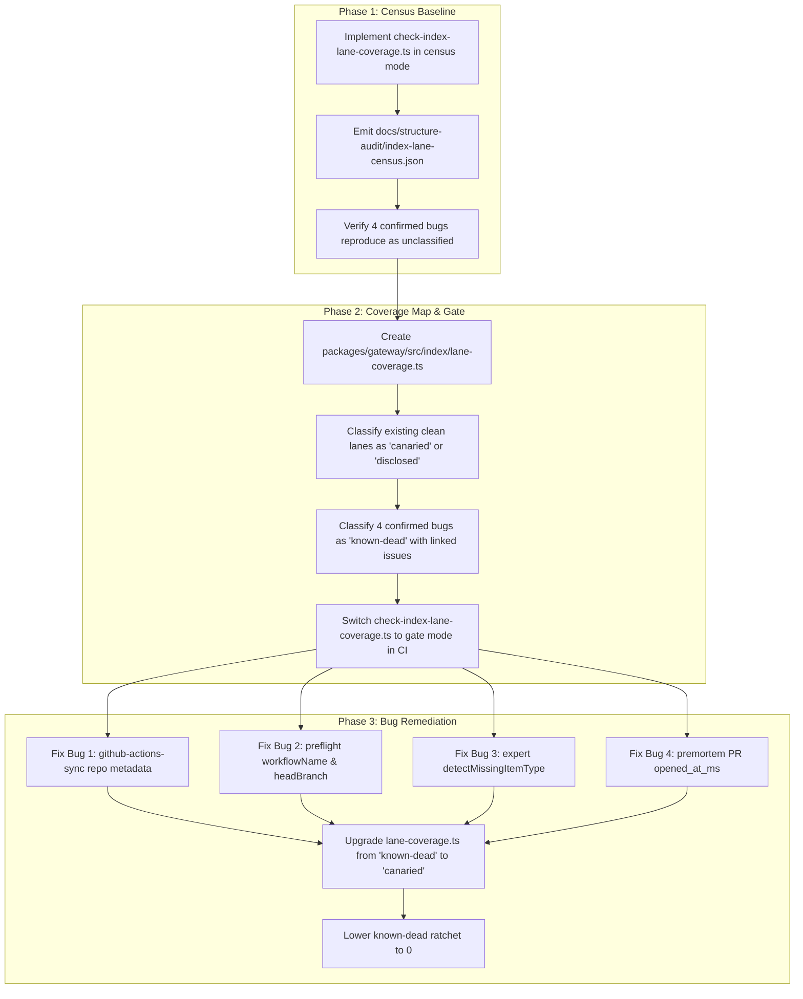

# Design Review: Index Lane Coverage Gate (B4)

**Review of:** [`2026-09-20-index-lane-coverage-design.md`](file:///C:/gitrep/Nimbus/.claude/worktrees/lane-coverage/docs/superpowers/specs/2026-09-20-index-lane-coverage-design.md)  
**Initiative:** B4 (bug-hunt audit) · `docs/roadmap.md` § Maintenance-initiative follow-ups  
**Date:** 2026-09-20  
**Status:** Approved with actionable recommendations & clarifications

---

## 1. Executive Summary & Verdict

The proposed design targets what is demonstrably the most pervasive silent-failure mode across the gateway: **contract mismatches at the data layer between SQL reader predicates / JS metadata extractors and connector writers**.

The core thesis is sound:
1. **The fixture trap is real.** Unit tests asserting against hand-rolled fixtures prove each end while systematically blinding the suite to the missing wire (`dora.test.ts`, `expert.e2e.test.ts`, `preflight.test.ts`).
2. **Table-awareness is mandatory.** Bare `type` exists across `graph_entity`, `graph_relation`, and `item`. A naive string scanner passes `expert.ts` green because `graph-populator.ts` emits `commit` to `graph_entity`.
3. **Census → Coverage Map → Canaries (Approach D) is the right architecture.** Static reader extraction + compiler-enforced coverage map + runtime canaries against real connector syncers provides enumeration and execution fidelity without relying on hand-maintained registries or leaky corpus scopes.

This review provides **open questions**, **architectural edge cases**, and **concrete improvements** to ensure the implementation in `scripts/structure-audit/check-index-lane-coverage.ts` and `packages/gateway/src/index/lane-coverage.ts` is airtight and resilient to long-term drift.

---

## 2. Key Strengths of the Design

- **Precise diagnosis of the defect class:** Clear taxonomy of the 4 confirmed bugs (DORA deploy selector missing `repo`, Preflight failing open due to `workflow_name`/`branch` mismatches, Expert's dead `commit` lane, and Premortem's unwritten `opened_at_ms` on PR items).
- **Anti-vacuity by construction:** Explicitly accounting for `demo/corpus/acme.ts` and `test/fixtures/` prevents the scanner from passing vacuously on synthetic data.
- **Pragmatic v1 scoping:** Restricting v1 to `item` (where all 4 confirmed bugs live and write chokepoints are clean at `index/item-store.ts` and `deployment/annotate.ts`) avoids boiling the ocean with the complex `(relation-type, from-entity-type, to-entity-type)` graph tuples.
- **Fail-closed gate semantics:** The census becomes a blocking gate the moment an unclassified triple is encountered in any production query.

---

## 3. Open Questions & Technical Nuances

### Q1: Multi-Service Queries vs `service:type` Keying
**Context (§4.2):**  
The coverage map is keyed on `service:type` (e.g. `github_actions:ci_run`), copying `glossary-source-types.ts`. However, many production reader queries query across multiple services simultaneously using dynamic placeholders:
```sql
-- packages/gateway/src/metrics/dora.ts:98
SELECT id, external_id, title, modified_at, metadata
FROM item
WHERE service IN (${placeholders})
  AND type = 'ci_run'
```
where `ciServices` resolves at runtime to `['github_actions', 'gitlab', 'jenkins', 'circleci']`.

- **Open Question:** When a query filters on `type = 'ci_run'` and extracts `json_extract(metadata, '$.conclusion')`, how does the census bind this reader triple?
- **Implication:** `conclusion` is emitted by `github_actions`, but GitLab emits `status`, Jenkins emits `result`, and CircleCI emits `state`. If the query runs over all four CI services, is the lane classified as covered, partially covered, or dead for the non-GitHub services?
- **Recommendation:** The census must emit a triple for **every** service configured/reachable by that query (or flag cross-service generic queries as requiring per-service capability assertions in the coverage map).

---

### Q2: Tracing JS-Side Metadata Key Accesses & Helper Delegations
**Context (§4.1):**  
The design includes a JS-side scan for `meta["<key>"]` after `JSON.parse(metadata)`. In practice, queries often delegate metadata inspection to helper functions across file boundaries or within the same module:
1. In [`metrics/dora.ts:111`](file:///C:/gitrep/Nimbus/packages/gateway/src/metrics/dora.ts#L111), `selectDeploys` calls [`repoLikeMatchesUrn(meta, row.external_id, u)`](file:///C:/gitrep/Nimbus/packages/gateway/src/metrics/dora.ts#L60-L77), which reads `metadata["repo"]`, `metadata["project"]`, and `metadata["jobName"]`.
2. In [`metrics/service-identity.ts:61-76`](file:///C:/gitrep/Nimbus/packages/gateway/src/metrics/service-identity.ts#L61-L76), `repoMetadataMatchesUrn` reads `metadata["repo"]`, `metadata["project"]`, and `metadata["jobName"]`.
3. In [`agents/standup-queries.ts`](file:///C:/gitrep/Nimbus/packages/gateway/src/agents/standup-queries.ts), metadata is passed to helper parsers.

- **Open Question:** How far will the static extractor trace metadata objects passed into helper functions?
- **Recommendation:**
  - If the helper is in the same file, AST traversal should follow arguments of type `Record<string, unknown>` derived from `row.metadata`.
  - For cross-file helpers (like `service-identity.ts`), either:
    a) Maintain an explicit manifest of metadata helper functions in the audit script, or
    b) Audit all functions accepting `ServiceIdentityItem` / `item.metadata` as metadata readers in their own right.

---

### Q3: Writer Extraction: Handling Future Connector Helpers
**Context (§3(A)):**  
The spec notes that 71% of connector write sites place their metadata keys outside `*-sync.ts` in 6 named helpers (`buildPagerdutyMetadata`, `extractPrMetadataForIndex`, `jiraDepthMetadata`, `linearDepthMetadata`, `pickAllowed`, `applyReportFieldPolicy`).
- **Open Question:** If a developer adds connector #30 next month and creates a helper like `extractSentryMetadata(...)`, will the static writer scanner fail to follow it?
- **Recommendation:** Rather than hardcoding the 6 helper function names, the AST extractor should follow **any** function call in `connectors/**` whose return value is assigned to the `metadata` property of an object passed to `ctx.upsertItem({...})` or `upsertIndexedItem(...)`.

---

### Q4: SQL Template Interpolation & CTEs
**Context (§4.1):**  
Queries in gateway frequently use template literal interpolations and Common Table Expressions (CTEs):
```sql
-- packages/gateway/src/preflight/preflight.ts:161-177
WITH ranked AS (
  SELECT id, service, type, title, url, modified_at, metadata,
         ROW_NUMBER() OVER (
           PARTITION BY service, COALESCE(
             json_extract(metadata, '$.workflow_name'),
             title,
             COALESCE(json_extract(metadata, '$.headSha'), '') || ':' || COALESCE(json_extract(metadata, '$.branch'), '')
           )
           ORDER BY modified_at DESC
         ) AS rn
  FROM item
  WHERE service IN (${servicePlaceholders})
    AND type = 'ci_run'
    AND json_extract(metadata, '$.branch') = ?
    AND json_extract(metadata, '$.conclusion') IN (${conclusionPlaceholders})
)
SELECT id, title, url, modified_at, metadata FROM ranked WHERE rn = 1
```
- **Open Question:** How will the SQL parser handle `${...}` expressions and CTE alias resolution?
- **Recommendation:**
  - Pre-process SQL string literals by replacing `${...}` template interpolations with valid SQL placeholder identifiers (`__INTERP_PARAM__`) prior to parsing.
  - Ensure the table-aliasing resolver recognizes CTE table sources (`WITH ranked AS (SELECT ... FROM item)` => `ranked` aliases `item` projections).

---

### Q5: Semantic Behavior of `detectMissingItemType`
**Context (§4.3):**  
`agents/_lib/gap-notes.ts` needs a new probe `detectMissingItemType(db, service, type)`.
- **Open Question:** What are the exact conditions and return payload for this probe?
  1. If `sync_state` for `service` is absent -> Returns `{ kind: "connector_missing", service }`.
  2. If `sync_state` is present, but `SELECT COUNT(*) FROM item WHERE service = ? AND type = ?` is 0:
     - Is this an empty index on an active connector (e.g. user simply has no open PRs), or an unsupported type?
  3. If the connector sync succeeded and items of other types exist (e.g., issues exist, but commits do not).
- **Recommendation:** Define the return type:
  ```ts
  export type ItemTypeGap =
    | { kind: "missing_connector"; service: string }
    | { kind: "empty_lane"; service: string; itemType: string };
  ```
  Ensure the probe distinguishes between "service not configured" and "service synced but 0 items of type X".

---

### Q6: Canary Timestamp Freshness & Time Window Decay
**Context (§4.4):**  
Production queries frequently apply relative time windows:
- `dora.ts`: `modified_at >= nowMs - sinceMs` (e.g., last 30 or 90 days)
- `expert.ts`: `modified_at >= Date.now() - 90 * 86_400_000`
- `preflight.ts`: `modified_at >= Date.now() - 7 * 86_400_000`

If canaries load static recorded JSON fixtures where `created_at` or `updated_at` is a fixed ISO string (e.g., `"2024-01-15T10:00:00Z"`), the canary will pass today but fail after the static date exceeds the 90-day window.
- **Recommendation:** The canary test harness must either:
  a) Dynamically adjust fixture timestamps relative to `Date.now()` during sync ingestion in `connector-sync-test-helpers.ts`, or
  b) Run queries with mocked/parameterized `nowMs` matching the fixture's timeline.

---

## 4. Concrete Improvements & Architectural Suggestions

### Suggestion 1: Typed Schema for `packages/gateway/src/index/lane-coverage.ts`

Define an explicit, strict TypeScript schema for the coverage map so it is type-checked by `tsc` / `bun test` and readable by the structure audit script:

```ts
export type LaneStatus =
  | {
      readonly kind: "canaried";
      readonly canaryTestFile: string;
      readonly canaryTestName: string;
    }
  | {
      readonly kind: "disclosed";
      readonly gapProbe: string; // e.g. "detectMissingItemType"
    }
  | {
      readonly kind: "known-dead";
      readonly reason: string;
      readonly issueUrl: string;
      readonly targetMilestone?: string;
    };

export type LaneCoverageEntry = {
  readonly service: string;
  readonly itemType: string;
  readonly requiredMetadataKeys: readonly string[];
  readonly status: LaneStatus;
  readonly notes?: string;
};

export const INDEX_LANE_COVERAGE: readonly LaneCoverageEntry[] = [
  {
    service: "github_actions",
    itemType: "ci_run",
    requiredMetadataKeys: ["workflowName", "conclusion", "headBranch", "headSha"],
    status: {
      kind: "canaried",
      canaryTestFile: "packages/gateway/src/metrics/dora.canary.test.ts",
      canaryTestName: "github_actions ci_run matches DORA selectDeploys",
    },
  },
  {
    service: "github",
    itemType: "commit",
    requiredMetadataKeys: [],
    status: {
      kind: "known-dead",
      reason: "github-sync writes git_commit to filesystem v2, not item.type='commit'",
      issueUrl: "https://github.com/nimbus/nimbus/issues/1560",
    },
  },
  // ...
];
```

---

### Suggestion 2: Anti-Stale & Ratchet Enforcement for `known-dead` Entries

Escape hatches tend to accumulate silently. We should apply the repo's existing invariant enforcement patterns (`check-nimbus-invariants.ts`):

1. **Monotonic Ratchet:** The number of `known-dead` entries should have a hard ceiling in `check-nimbus-invariants.test.ts` (e.g., maximum 4 on day one). Any addition must update the ratchet, requiring explicit review.
2. **Anti-Stale Canary Detection:** When the census runs, if a lane marked `known-dead` is found to have both a writer emitting the key AND an active reader, the gate **fails with an error**:
   > `Error: Lane github:commit is marked 'known-dead' but writer now emits this type. Upgrade classification to 'canaried' or 'disclosed'.`
3. **Format Validation:** `known-dead` entries must require a non-empty `reason` and a valid issue reference (regex: `/#\d+|https:\/\/github\.com\//`).

---

### Suggestion 3: Field Value & Type Semantic Validation

Beyond key existence, contract mismatches often occur due to:
- **Casing mismatches:** `workflowName` vs `workflow_name`, `headBranch` vs `branch`.
- **Value type mismatches:** SQLite `json_extract` returning integer `1` when SQL queries `LOWER(json_extract(...)) = 'p1'` (e.g. `severity`).
- **Nullability vs Absence:** Missing key returning SQL `NULL` causing `WHERE key = ?` to evaluate to `NULL` (falsy) instead of matching.

**Recommendation:**  
Canaries should not merely assert `rows.length >= 1`, but run the actual production reader query against the populated SQLite DB and assert that the output fields (e.g., `row.workflow_name` or parsed `meta.conclusion`) match the expected downstream TypeScript types.

---

### Suggestion 4: Clarify v1 Scope for Cross-Table JOIN Queries

Many agent lanes join `item` with `graph_entity` or `person` (e.g. `expert.ts:383-384` joining `item i JOIN person p ON p.id = i.author_id`).
- Under v1's scope (§5), the census only audits the `item` predicates (`i.service = 'github' AND i.type = 'commit'`).
- The `person` table predicates are ignored by the static extractor in v1.
- **Clarification to add to spec:** Document that while static extraction is confined to `item` in v1, the **canary test** for that lane must seed both the `item` row and any associated foreign rows (`person`, `deployment_items`, etc.) using real sync helpers, proving the entire SQL query succeeds end-to-end.

---

### Suggestion 5: Phased Rollout Sequence

To maintain CI greenness on `main` without circular blockers, execute in 3 explicit phases:



1. **Phase 1 (Census Tooling):** Ship `scripts/structure-audit/check-index-lane-coverage.ts` in report-only mode and establish the baseline artifact in `docs/structure-audit/`.
2. **Phase 2 (The Gate):** Ship `packages/gateway/src/index/lane-coverage.ts` with all clean lanes classified and the 4 known bugs classified as `known-dead` (linked to tracking issues). Enable the blocking invariant in `check-nimbus-invariants.test.ts`.
3. **Phase 3 (Remediation):** Open targeted PRs fixing each of the 4 bugs, adding recorded canary fixtures, and upgrading their status in `lane-coverage.ts` from `known-dead` to `canaried` or `disclosed`.

---

## 5. Summary Checklist of Next Actions

| # | Action Item | Target Location | Priority |
|---|---|---|---|
| 1 | Add pre-processing to SQL extractor for `${...}` template interpolations and CTE aliases | `scripts/structure-audit/check-index-lane-coverage.ts` | High |
| 2 | Add relative timestamp normalization to canary sync runner for time-windowed queries | `packages/gateway/src/connectors/connector-sync-test-helpers.ts` | High |
| 3 | Define typed `INDEX_LANE_COVERAGE` schema with discriminator `kind` | `packages/gateway/src/index/lane-coverage.ts` | High |
| 4 | Implement `detectMissingItemType` probe in gap notes | `packages/gateway/src/agents/_lib/gap-notes.ts` | High |
| 5 | Add monotonic ratchet and anti-stale validation for `known-dead` entries | `scripts/structure-audit/check-nimbus-invariants.test.ts` | Medium |
| 6 | Document multi-service query classification rules in the design doc | `docs/superpowers/specs/2026-09-20-index-lane-coverage-design.md` | Medium |
