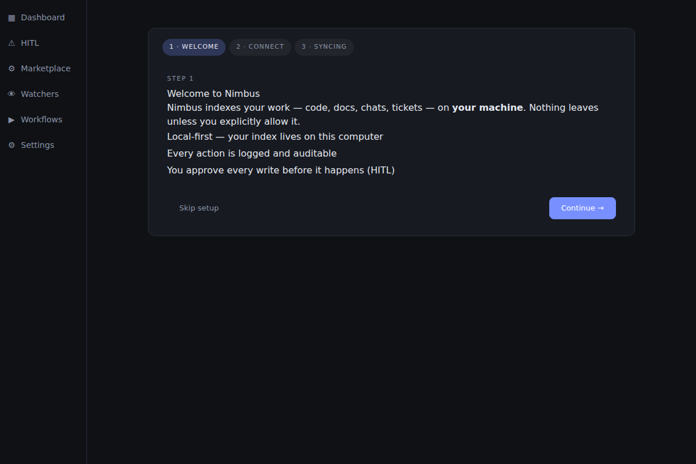
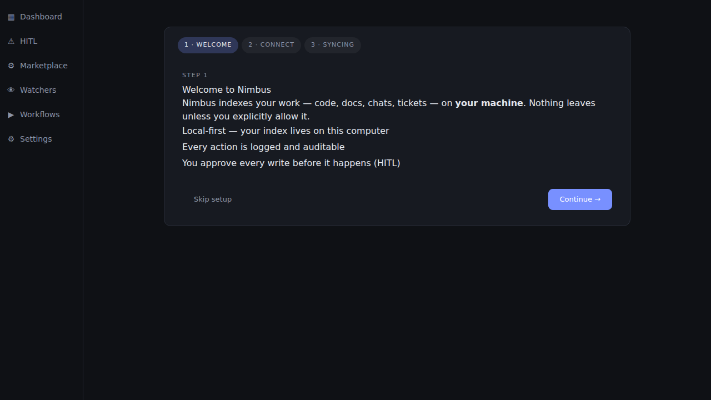
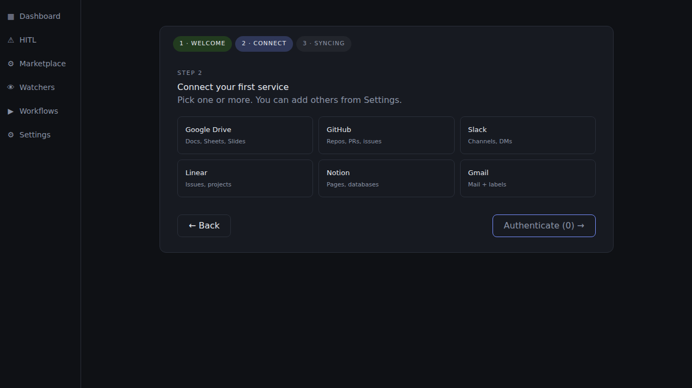
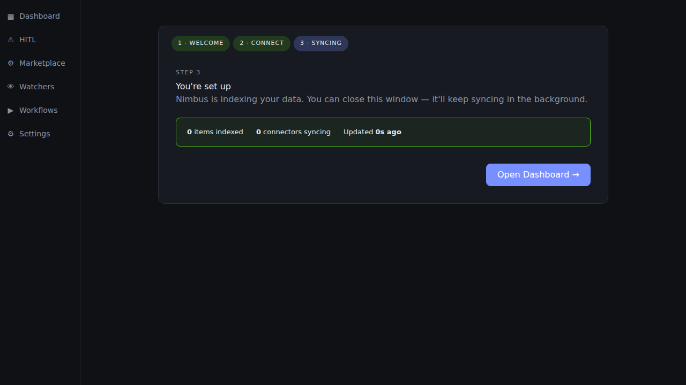
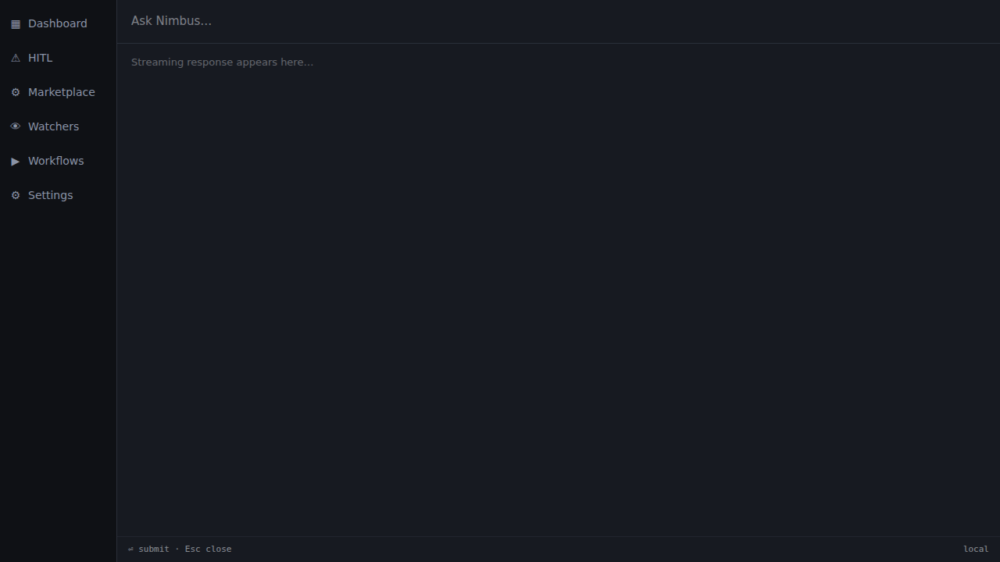

import { CardGrid, LinkCard } from "@astrojs/starlight/components";

When you start the Nimbus desktop app for the first time, it launches the
headless Gateway, opens the onboarding wizard, registers a system tray icon,
and optionally binds a global hotkey for Quick Query. This page walks through
each step.

---

## What launches

Starting the Tauri desktop app triggers three things in parallel:

1. **Gateway process.** A headless Bun process starts in the background. It
   creates the local SQLite index, loads your configuration, and opens the
   JSON-RPC IPC socket. The Gateway continues running even when the UI window
   is closed.
2. **Onboarding wizard.** On first launch (no connectors configured), the UI
   opens to the onboarding wizard rather than the dashboard.
3. **System tray icon.** A Nimbus icon appears in the system tray
   (notification area). It shows aggregate connector health and gives you
   one-click access to the UI or Quick Query.

Subsequent launches skip the wizard and go directly to the dashboard.

---

## Onboarding wizard — Step 1: Welcome

The welcome screen introduces Nimbus and its three core principles:
local-first indexing, structural HITL consent, and vault-only credentials.

Click **Continue** to proceed to service selection, or **Skip** to go straight
to the dashboard with no connectors configured (you can add them later via
Settings → Connectors).

---

## Onboarding wizard — Step 2: Connect a service

The service selection screen shows connector cards for the six most commonly
used integrations. Click a card to select it, then click **Authenticate** to
open the OAuth flow in your system browser.

| Card | What it indexes |
|---|---|
| Google Drive | Files, folders, recent edits, shared-with-me |
| Gmail | Threads, labels, attachments metadata |
| GitHub | Pull requests, issues, commits, repositories |
| Slack | Channels, threads, DMs (with your consent per workspace) |
| Linear | Issues, cycles, projects, comments |
| Notion | Pages, databases, comments |

You can select multiple services before clicking Authenticate — the wizard
queues OAuth flows in sequence. You do not need to connect any service at this
step; the assistant works immediately against any connectors already
configured.

For the full OAuth walkthrough (what scopes are requested, what is indexed,
how to revoke access), see
[Connect your first service](/user-guide/connect-your-first-service/).

---

## Onboarding wizard — Step 3: Syncing

After a successful OAuth handshake, the wizard moves to the syncing screen.
A live counter shows how many items have been indexed so far. Initial sync
time depends on the size of your account — a GitHub account with several
hundred PRs typically finishes in under 60 seconds.

You do not need to wait for sync to complete. Click **Open Dashboard** at
any time to start using Nimbus. The index continues building in the background
and queries return progressively better results as more items are indexed.

---

## Skipping onboarding

If you clicked **Skip** on the welcome page, you land on the dashboard with
no connectors configured. The connector grid shows empty tiles. To add
connectors later:

1. Click **Settings** in the sidebar (or press `S`).
2. Navigate to **Connectors**.
3. Click the connector you want to add and follow the OAuth flow.

---

## System tray

The Nimbus system tray icon reflects aggregate connector health:

| Colour | Meaning |
|---|---|
| Green | All configured connectors healthy |
| Amber | One or more connectors degraded (stale data, rate-limited) |
| Red | One or more connectors failed or unauthorised |
| Grey | Gateway not running |

**Right-click** the tray icon for the context menu:

- **Open Nimbus** — bring the main window to the foreground.
- **Quick Query** — open the frameless Quick Query popup (same as the hotkey).
- **Connectors** — submenu listing each configured connector; clicking one
  deep-links to its Settings panel.
- **Quit** — stop the Gateway process and exit.

---

## Quick Query (global hotkey)

Quick Query is a frameless popup window that lets you ask Nimbus anything
without switching away from your current application.

**Default hotkey:**

| Platform | Hotkey |
|---|---|
| macOS | `Cmd + Shift + N` |
| Windows / Linux | `Ctrl + Shift + N` |

Press the hotkey from anywhere:

1. The Quick Query window appears centred on your primary display.
2. Type your question and press **Enter**.
3. The response streams into the window.
4. The window auto-closes approximately 2 seconds after the stream finishes.
5. Press **Esc** at any time to close immediately.

---

## Hotkey conflicts

If another application has already bound `Ctrl + Shift + N` (or
`Cmd + Shift + N`), the Tauri toolbar shows a banner:

> "Could not register global shortcut Ctrl+Shift+N — another app may be using it."

To resolve this:

- Change the conflicting application's hotkey binding, **or**
- In Nimbus, navigate to **Settings → Advanced** to remap the Quick Query
  hotkey (post-v0.1.0 feature — not available in v0.1.0; for now, adjust the
  conflicting application).

The rest of Nimbus works normally even when the global hotkey cannot be
registered — use the tray icon's **Quick Query** menu item as an alternative.

---

## Where to next

<CardGrid>
  <LinkCard
    title="Connect your first service"
    href="/user-guide/connect-your-first-service/"
    description="Full OAuth walkthrough for Google Drive, GitHub, Slack, and more."
  />
  <LinkCard
    title="Your first query"
    href="/user-guide/your-first-query/"
    description="Run your first query from the CLI or the Tauri desktop app."
  />
  <LinkCard
    title="HITL & safety"
    href="/user-guide/hitl-and-safety/"
    description="What actions are gated, what the consent dialog looks like, and how the audit log works."
  />
</CardGrid>
