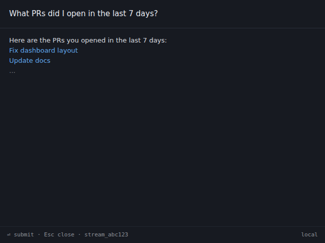

import { CardGrid, LinkCard } from "@astrojs/starlight/components";

Once at least one connector is syncing, Nimbus can answer questions against
your local index. This page shows the two surfaces — the Tauri desktop app and
the CLI — and explains what happens under the hood when you ask a question.

---

## Two surfaces, same Gateway

The **Tauri desktop app** (Quick Query popup and full Chat panel) and the
**CLI** (`nimbus ask`, `nimbus query`) are both thin clients. They communicate
with the Gateway over JSON-RPC 2.0 IPC — a domain socket on macOS / Linux, a
named pipe on Windows. The Gateway holds the index, runs the agent, and streams
results back. Both surfaces produce the same answer from the same audit trail.

---

## Quick Query (desktop)

**Quick Query** is the fastest way to ask a one-off question without switching
away from your current application.

1. Press the global hotkey from anywhere:

   | Platform | Hotkey |
   |---|---|
   | macOS | `Cmd + Shift + N` |
   | Windows / Linux | `Ctrl + Shift + N` |

2. The frameless Quick Query window appears centred on your primary display.
   Type your question and press **Enter**.
3. Tokens stream into the response area as they arrive from the LLM.
4. The window auto-closes approximately 2 seconds after the stream finishes.
5. Press **Esc** at any time to close immediately and discard the response.



The Quick Query popup is intentionally minimal — no history, no follow-up
prompts. For a multi-turn conversation, open the full **Chat** panel from the
sidebar.

---

## `nimbus ask` (CLI)

The CLI surface is useful for scripting, piping output into other tools, or
when you prefer the terminal.

```bash
nimbus ask "What PRs did I open in the last 7 days?"
```

Tokens stream to stdout as they arrive. The response ends with a trailing
newline when the stream is complete.

**Pipe the output:**

```bash
nimbus ask "Summarise my open Linear issues as a bullet list" | pbcopy
```

**Cancel mid-stream:**

Press `Ctrl+C`. The Gateway receives the cancel signal and stops dispatching
new chunks. Any pending tool calls in the current agent step are aborted. The
Gateway process itself continues running.

---

## What just happened

When you send a question, the Gateway runs the following pipeline:

1. **Intent classification.** The LLM router classifies the question to decide
   which data sources and tools are relevant.
2. **Semantic search.** The Gateway queries the local SQLite index (metadata +
   embeddings) to find items that match the question context.
3. **Optional connector tool calls.** For questions that require live data
   beyond what is indexed (e.g., fetching a specific file body, resolving a PR
   diff), the agent dispatches read-only MCP tool calls to the relevant
   connector processes. Write tools are never called without a HITL consent
   prompt.
4. **LLM synthesis.** The ranked context and tool results are passed to the LLM
   (local via Ollama / llama.cpp, or remote if configured). The LLM generates
   a response token by token.
5. **Streaming.** Tokens arrive over the `engine.askStream` IPC notification
   channel and are forwarded to the client surface.

For a full description of the agent pipeline, see the
[Architecture overview](/architecture-overview/).

---

## Index-only queries — `nimbus query`

For structured queries that do not need the LLM, use `nimbus query`. It reads
directly from the local index — faster, deterministic, and scriptable.

**Query by service and type:**

```bash
# All PRs from the last 7 days
nimbus query --service github --type pr --since 7d --json

# Pinned items, formatted as cards
nimbus query --service linear --type issue --json
```

**Raw SQL (read-only guard):**

```bash
nimbus query --sql "SELECT title FROM items WHERE pinned = 1" --pretty
```

The `--sql` flag passes the statement through a read-only guard: only `SELECT`
statements are accepted. `INSERT`, `UPDATE`, `DELETE`, `DROP`, and DDL
statements are rejected at the parser before reaching the database.

**Output modes:**

| Flag | Output |
|---|---|
| (none, TTY) | Human-readable card format |
| (none, piped) | Compact JSON, one object per line — jq-friendly |
| `--json` | Pretty-printed JSON (2-space indent) |
| `--pretty` | Force card format even when piped |

---

## Streaming details

All `nimbus ask` responses stream token-by-token over the IPC notification
channel (`engine.askStream`). The Tauri Chat panel renders Markdown
incrementally as tokens arrive. The CLI writes each chunk to stdout as a UTF-8
string fragment without buffering.

If the stream stalls for more than 15 seconds with no new tokens (network
latency or a slow local model), the CLI prints a `[stalled]` marker and waits.
The stream resumes automatically when the model produces the next token.

---

## Cancel semantics

| Surface | How to cancel |
|---|---|
| CLI | `Ctrl + C` |
| Chat panel | **Stop** button |
| Quick Query | `Esc` (closes the window and cancels) |

Cancelling sends a cancel signal to the Gateway's agent executor. The LLM may
complete the current in-flight chunk before stopping — no partial chunks are
discarded mid-token. Any pending read tool calls are aborted. Gated write
actions that have not yet received a HITL approval are dropped.

---

## Where to next

<CardGrid>
  <LinkCard
    title="HITL & safety"
    href="/user-guide/hitl-and-safety/"
    description="What actions are gated, what the consent dialog looks like, and how the audit log works."
  />
  <LinkCard
    title="Watchers"
    href="/user-guide/watchers/"
    description="Trigger automated agent runs when indexed data matches a condition."
  />
  <LinkCard
    title="Workflows"
    href="/user-guide/workflows/"
    description="Chain multi-step actions into reusable, parameterised workflows."
  />
</CardGrid>
